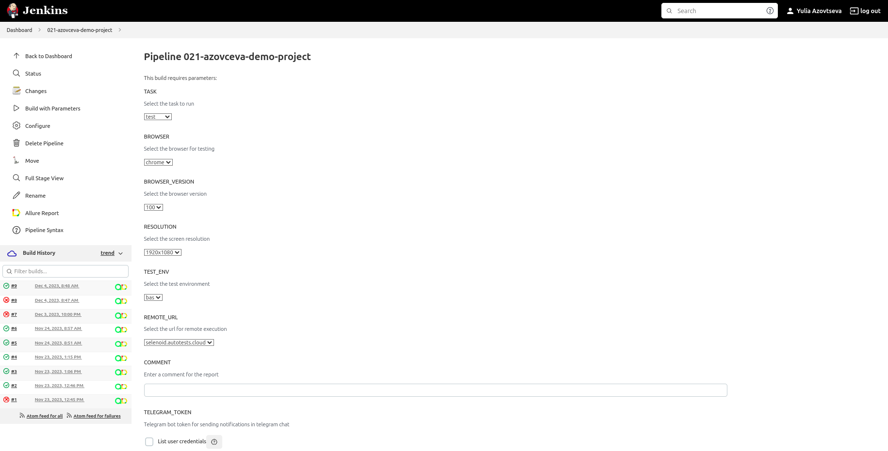
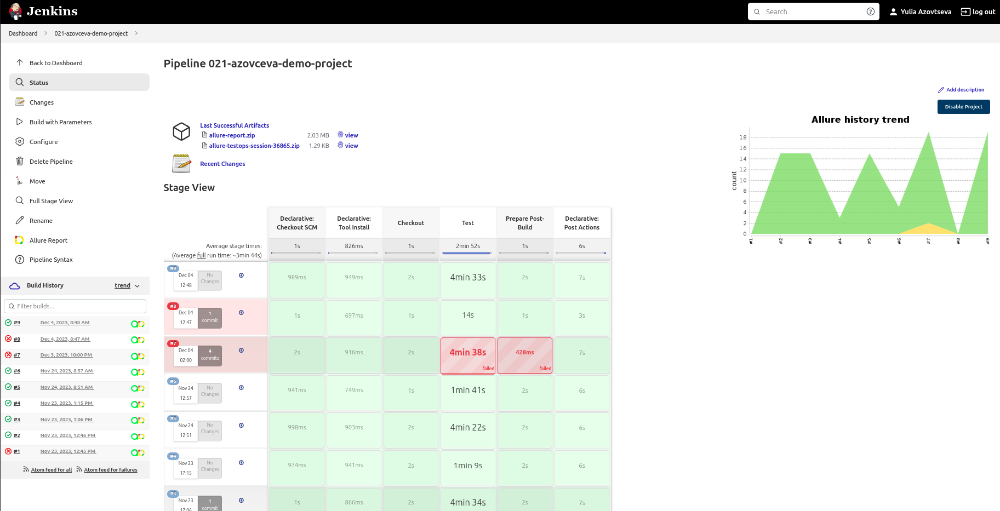
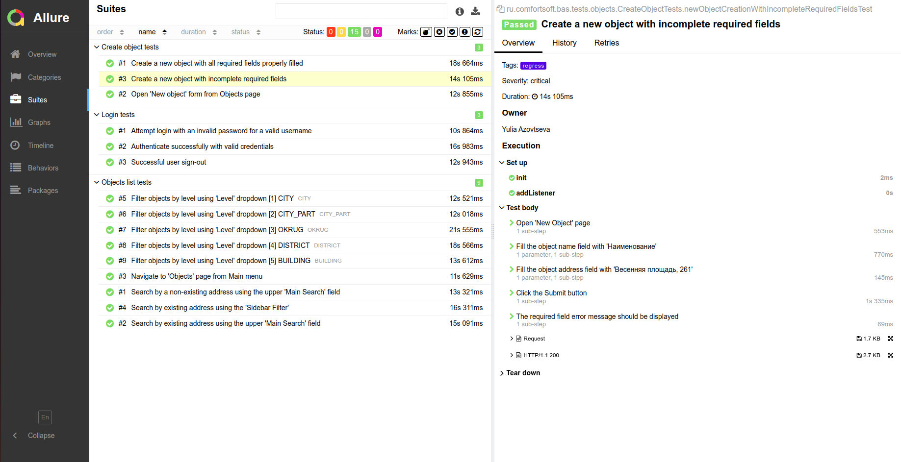
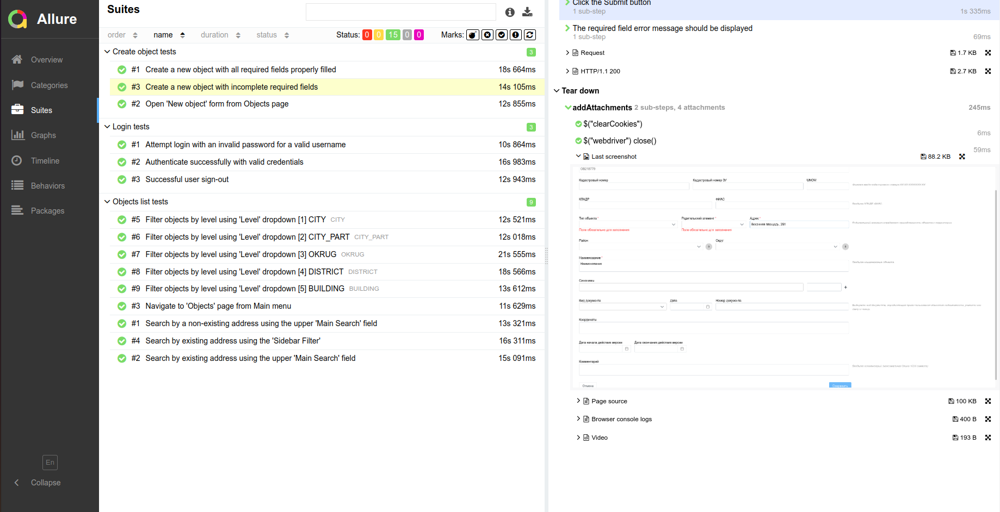
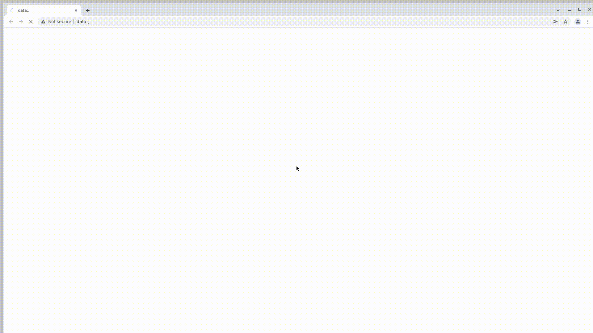
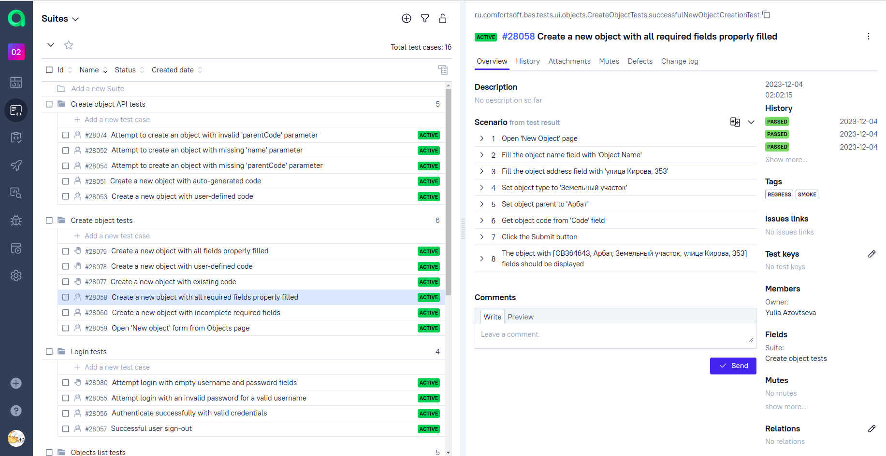
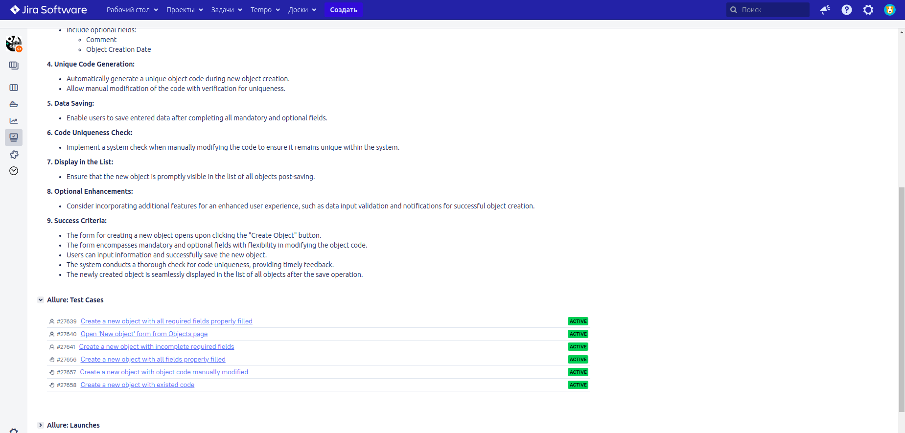
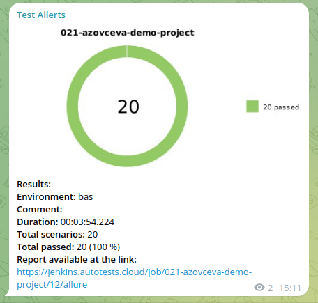

### Contents

[Tools and Libraries](#tech-and-instruments)\
[API Testing](#api-tests)\
[UI Test Cases ](#tests)\
[Running Tests](#how-to-run)\
[Allure Report](#allure-report)\
[Report Artefacts](#test-artefacts)\
[Integration with Allure TestOps](#allure-test-ops)\
[Integration with Jira](#jira)\
[Allure Notifications](#telegram-notification)

> :information_source:   This testing project is for demonstration purposes only and covers only a limited part of the overall functionality.

The primary goal is to highlight some aspects of my skills in Java testing and related technologies.

It designed for a web "Basic Analytical System". This system deals with data related to buildings and other objects of the urban environment.

----

### <a name="tech-and-instruments"></a>Tools and Libraries

<p>

[](https://www.java.com/)
[](https://www.jetbrains.com/idea/)
[](https://gradle.org/)
[](https://junit.org/junit5/)
[](https://ru.selenide.org/)
[](https://rest-assured.io/)
[](https://github.com/)
[](https://www.jenkins.io/)
[](https://aerokube.com/selenoid/)
[](https://allurereport.org/)
[](https://qameta.io/)
[](https://www.atlassian.com/software/jira/)

</p>

* [Gradle](https://gradle.org/) for build automation
* [JUnit 5](https://junit.org/junit5/) to support the test creation
* [Selenide](https://ru.selenide.org/) for accelerated development based on Selenium WebDriver
* [RestAssured](http://rest-assured.io/) library to test REST APIs
* [Owner](https://matteobaccan.github.io/owner/) to manage the property files
* [Lombok](https://projectlombok.org/features/) to simplify java code
* [Java-faker](https://github.com/DiUS/java-faker) to generate fake data
* [AssertJ](https://assertj.github.io/doc/) to assertions
* [Allure Report](https://docs.qameta.io/allure/) as the testing report strategy
* [Selenoid](https://aerokube.com/selenoid/) for running browsers in Docker containers
* [Jira](https://www.atlassian.com/software/jira/) for task management
* [Jenkins](https://www.jenkins.io/) for remote test execution
* [Allure TestOps](https://qameta.io/) for test management

----

### <a name="api-tests"></a>API Testing

In this part of the project, there are several tests of API endpoint:

| Request                  | What it does         |
|--------------------------|----------------------|
| `POST /v1/dict-data/obj` | Creates a new object |

Tests include both basic positive (happy paths) and negative scenarios:

1. Create a new object with auto-generated code
2. Create a new object with user-defined code
3. Attempt to create an object with existing code
4. Attempt to create an object with missing 'name' parameter
5. Attempt to create an object with invalid 'parentCode' parameter

[↑ to contents](#contents)

----

### <a name="tests"></a>UI Test Cases

In this part of the project, there are three suites of UI tests.
Some of these tests also use API calls to assist the UI steps and setting preconditions.

Login tests
1. Authenticate successfully with valid credentials
2. Successful user sign-out
3. Attempt login with an invalid password for a valid username

Objects list tests
1. Navigate to 'Objects' page from Main menu
2. Filter objects by level using 'Level' dropdown
2. Search by existing address using the upper 'Main Search' field
3. Search by existing address using the 'Sidebar Filter'
4. Search by a non-existing address using the upper 'Main Search' field

Create new object tests
1. Open 'New object' form from Objects page
2. Create a new object with all required fields properly filled
3. Attempt to create a new object with incomplete required fields

[↑ to contents](#contents)

----

### <a name="how-to-run"></a>Running Tests

To execute tests, you can use the standard Gradle `test` task for running tests or one of the custom tasks `regress` or `smoke` to run specific test groups.

Launch parameters for tests execution are stored in .properties files: 
- Use `-Denv` to define the test environment  
- Use `-Dweb` to configure the web browser 

For example to run tests locally:

```commandline
 gradle clean test -Denv=bas -Dweb=locale
```

For remote browser execution in Selenoid:

```commandline
 gradle clean test -Denv=bas -Dweb=remote
```

From Jenkins:

This project uses pipeline to run autotests with parameters in [Jenkins](https://jenkins.autotests.cloud/job/021-azovceva-demo-project/).
<p>

</p>

Once the job is complete, you can get a summary of the test run and access the Allure report.
<p>

</p>

[↑ to contents](#contents)

----

### <a name="allure-report"></a>Allure Report

After the tests have passed, [Allure Report](https://jenkins.autotests.cloud/job/021-azovceva-demo-project/allure/) is generated.
Each test is presented in the report as a series of steps with readable names.

<p>

</p>

[↑ to contents](#contents)

----

### <a name="test-artefacts"></a>Report Artefacts
Detailed information, including snapshots, screenshots, and screen recordings for analyzing failed tests, is saved in the Report.

<p>

</p>

Recording a video of test execution can help to identify any issues or errors that occur during the test run.

<p>

</p>

[↑ to contents](#contents)

----

### <a name="allure-test-ops"></a>Integration with Allure TestOps
The integration between Jenkins and Allure works in both directions. Test results are collected in real-time from the build server during the execution of the build job. Additionally, tests can be initiated directly from the Allure interface. Manual and automated checks are combined into one test suite.

<p>

</p>

[↑ to contents](#contents)

----

### <a name="jira"></a>Integration with Jira
The Jira ticket is linked with tests from Allure TestOps.

<p>

</p>

[↑ to contents](#contents)

----

### <a name="telegram-notification"></a>Allure Notifications 
Using the Allure notifications library, automatic notifications about the test results are sent to Telegram (also works with Slack, Skype, Email, Mattermost, Discord, Loop).

<p>

</p>

[↑ to contents](#contents)

----
